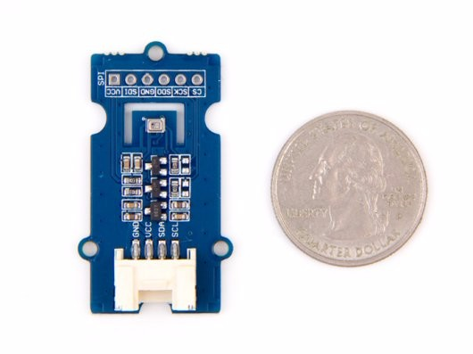
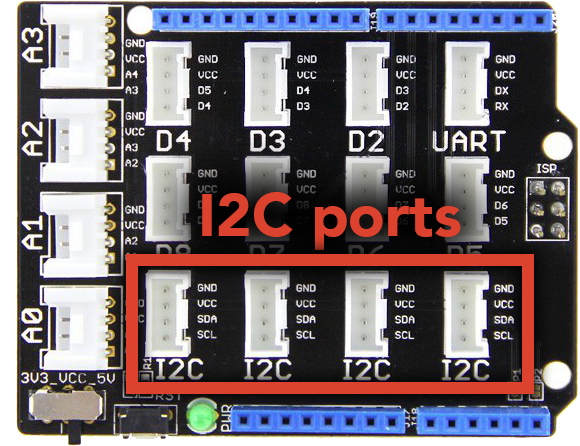

The
http://wiki.seeedstudio.com/Grove-Barometer_Sensor-BMP280[Barometer Sensor]
can be used to measure temperature and atmospheric pressure accurately. As the atmospheric pressure changes with altitude, it can also measure approximate altitude of a place.

<!--more-->

== Hardware

Plug the sensor into any of the I2C ports on your
https://www.seeedstudio.com/Base-Shield-V2-p-1378.html[Grove shield]:

== Software

Functions that interact with the barometer are prefixed with `bmp`.

=== Initialization

Before the barometer can be used, you must connect it to an I2C port on the
Grove shield and call the `bmpInit()` function:

[source, language=C++]
----
/**
 * Set up the barometer for use.
 *
 * This function must be called before any of the other barometer functions will work.
 */
void bmpInit();
----

This tells the software library that you are using a barometer and that you
have plugged in into an I2C port.
You must call this function before anything else will work.

=== Temperature

You can use the barometer to get temperature measurements in Celsius:

[source, language=C++]
----
/**
Gets temperature reading in Celsius from barometer

@returns	Value representing temperature in Celsius
*/
float bmpGetTemperature();
----

=== Atmospheric Pressure

As indicated, you can use the barometer to get atmospheric pressure measurements in Pascals:

[source, language=C++]
----
/**
Gets pressure reading in Pa from barometer

@returns	Value representing pressure in Pa
*/
unsigned int bmpGetPressure();
----

=== Altitude

As the atmospheric pressure changes with altitude, the barometer can also measure approximate altitude in meters of a place:

[source, language=C++]
----
/**
Gets altitude reading in m from barometer
@ param pressure - pressure reading from barometer (or other source)

@returns	Value representing altitude in m
*/
float bmpCalcAltitude(float pressure);
----
