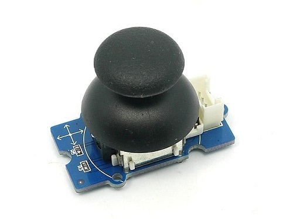

---
title: Thumb Joystick
---

The
http://wiki.seeedstudio.com/Grove-Thumb_Joystick/[Grove Thumb Joystick]
is an link:{}[analog device] that connects to one analog port on the Grove shield but uses two analog pins on the Arduino to get X and Y components of the joystick's movement.

<!--more-->

The X and Y axes are two ~10k potentiometers which control 2D movement by generating analog signals. The joystick also has a push button that could be used for special applications. It will output two analog values, representing two directions.

== Hardware

The
http://wiki.seeedstudio.com/Grove-Thumb_Joystick/[Thumb Joystick]
is an link:{}[analog device] that connects to one analog port on the Grove shield but uses two analog pins on the Arduino to get X and Y components of the joystick's movement:

image::../shield-analog.png[Analog ports on the Grove shield v2.0, height=250]

== Software

There are no special library functions associated with the thumb joystick. The `analogRead` function is used to retrieve information about the Thumb Joystick position. 

=== Initialization

No special initialization is required for interacting with analog components.

=== Retrieving and interpreting position information

The thumb joystick will output two analog values, representing two directions. The `analogRead` function is used obtain these values - the reading from `A_x_` will be the x position and the reading from `A_x+1_` will be the y position.  

For example, if the joystick is connected to port `A0`, the following code can be used to get positioning.

[source, language=C++]
----
int X = analogRead(A0);
int Y = analogRead(A1); 
----

X and Y values indicating position typically range in [200, 800]. *The origin is approximately located at (500, 500) but there is some minor variance, typically +/- 20 in either direction*.

=== Retrieving and interpreting click position

The thumb joystick also has a push button. *If the x position is greater than 1000, the button has been pushed.*
