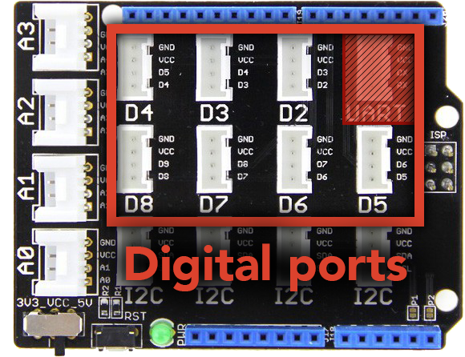

Simple digital components can either be _on_ or _off_.
Interacting with them is straightforward.

<!--more-->

[.centered]
image:button.jpeg[Button, height=150]

== Hardware

Digital components can include buttons, single-LED sockets, relays and more.
These components are connected to one of the digital ("D") ports on the Grove
shield:

== Software

Functions for interacting with digital pins are prefixed with `digital`.

=== Initialization

No special initialization is required for interacting with digital components.

=== Reading from digital pins

You can read a `true` or `false` value from a digital pin using the
`digitalRead` function provided by the core Arduino libraries:

[source, language=C++]
----
/**
 * Read from a digital pin.
 *
 * @param    pin          which digital pin to read from
 */
bool digitalRead(int pin);
----

This will return `true` or `false`.

=== Writing to digital pins

To write a digital value to an actuator such as an LED socket or a relay,
use the `digitalWrite()` function provided by the core Arduino libraries:

[source, language=C++]
----
/**
 * Write to a digital pin.
 *
 * @param    pin          which digital pin to write to
 * @param    value        the value to write
 */
void digitalWrite(int pin, bool value);
----
