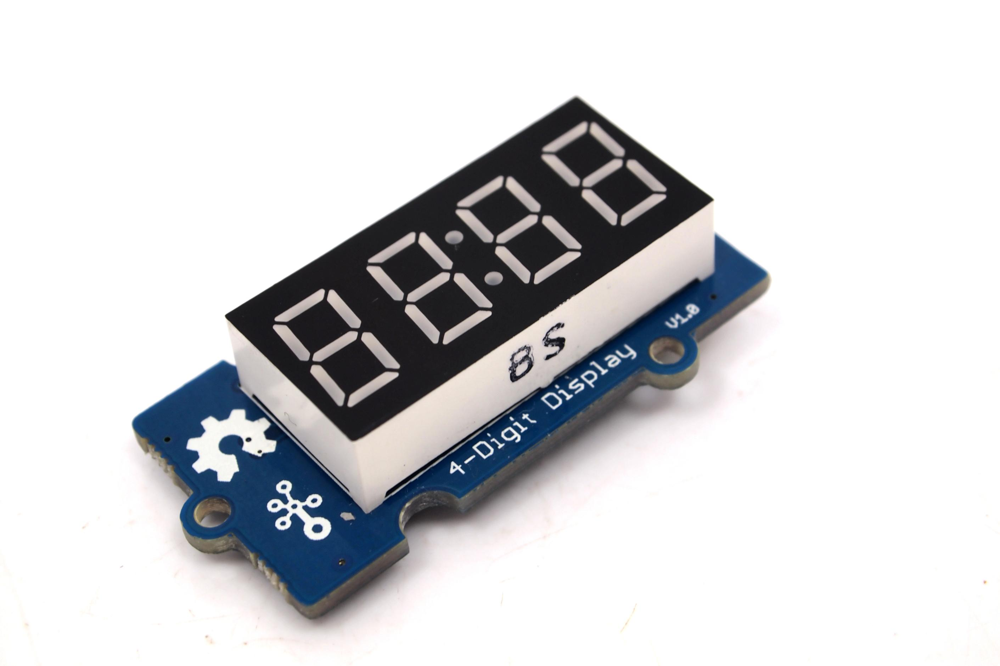

The
http://wiki.seeedstudio.com/Grove-4-Digit_Display[Grove 4-Digit Display]
is a typical "digital watch" interface that is a nice choice for projects requiring alpha-numeric display.

<!--more-->

== Hardware

The 4-Digit display should be plugged into a **digital port** on your
https://www.seeedstudio.com/Base-Shield-V2-p-1378.html[Grove shield]:

image::../shield-digital.png[Digital ports on the Grove shield v2.0, height=250]

== Software

Functions that interact with the 4-digit display are prefixed with `segment`.

=== Initialization

To prepare the software library to use the 4-digit display, first call the
`segmentInit` function, telling it which pin it is connected to:

[source, language=C++]
----
/**
 * Prepare to use a 40digit display.
 *
 * @param   pin     the **digital** pin the component is attached to
 */
void segmentInit(int pin);
----

=== Display Digits

We can choose to display one character/digit in one location on the digital display, or to display four characters/digits on the display.

To display one digit in a particular location, call `segmentDisplayDigit()`:

[source, language=C++]
----
/**
Display character (can be number or letter) in location on display

@param loc - which spot on display to show character
	@pre: 0 <= loc <= 3
	
@param data - character/digit you want to display

@modifies	Display
*/
void segmentDisplayDigit(unsigned int loc, unsigned int data);
----

To fill the entire display with digits, call `segmentDisplayAll()`:

[source, language=C++]
----
/**
Display characters (can be number or letter) on display

@param data - characters/digits you want to display, in order in array you want to display them
	@pre: length(data) == 4

@modifies	Display
*/
void segmentDisplayAll(unsigned int  data[]);
----
