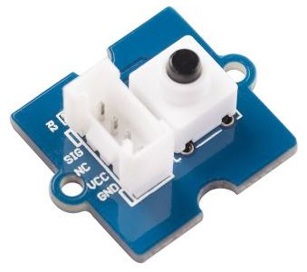
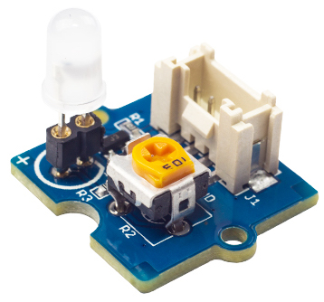
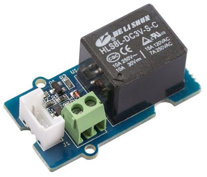

Many of the components that are included in the Grove kit can be used with
generic (rather than device-specific) software support.

<!--more-->

[.centered]
image:analog/rotary-dial.jpeg[Rotary dial, height=100]
image:analog/light-sensor.jpeg[Light sensor, height=100]

link:{}[Specialized components] for the Grove kit
require specialized software libraries.
However, generic link:{}[analog] and
link:{}[digital] components can be used via generic
Arduino library functions such as
`analogRead` and `digitalWrite`.
