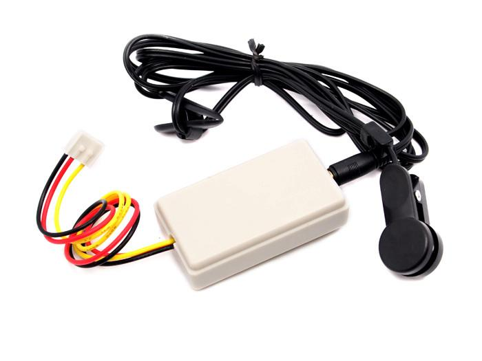

The
http://wiki.seeedstudio.com/Grove-Ear-clip_Heart_Rate_Sensor[
  Grove Ear-clip Heart Rate Sensor]
can be used to monitor heart rate of patients and athletes. The entire system is a high sensitivity, low power consumption and portable.

<!--more-->

== Hardware

The heart rate sensorshould be plugged into a **digital port** on your
https://www.seeedstudio.com/Base-Shield-V2-p-1378.html[Grove shield]:

image::../shield-digital.png[Digital ports on the Grove shield v2.0, height=250]

== Software

Functions that interact with the heart rate sensor are prefixed with `hr`.

=== Initialization

To prepare the software library to use the heart rate sensor, first call the
`hrInit` function, telling it which pin it is connected to and how many heart beats you wish to collect to calculate heart rate:

[source, language=C++]
----
/**
Initialises HR monitor so it can be used

@param		inputPort	Which digital port to which the HR Sensor is connected
@param		sampleCount	How many heart beats you want to collect before you wish to calculate heart rate @pre sampleCount < 100
*/
void hrInit(int inputPort, int sampleCount);
----

=== Get Heart Rate Information

When called, the function `hrGetIntervals` returns true and will populate an array passed in with the _intervals in milliseconds_ between detected heart beats (ie. time in milliseconds between one heart beat and the next). This information can be used to calculate heart rate. 

If there are not enough heart beats detected thus far (the number specified with `sampleCount`), the function returns false.

[source, language=C++]
----
/**
If enough heart rate samples available, populates array passed in with intervals between heartbeats

@params		intervals	Array to hold intervals, 
		@pre length of intervals >= sampleCount

@return true if enough interval data available, false otherwise
*/
bool hrGetIntervals(unsigned long intervals[]);
----
