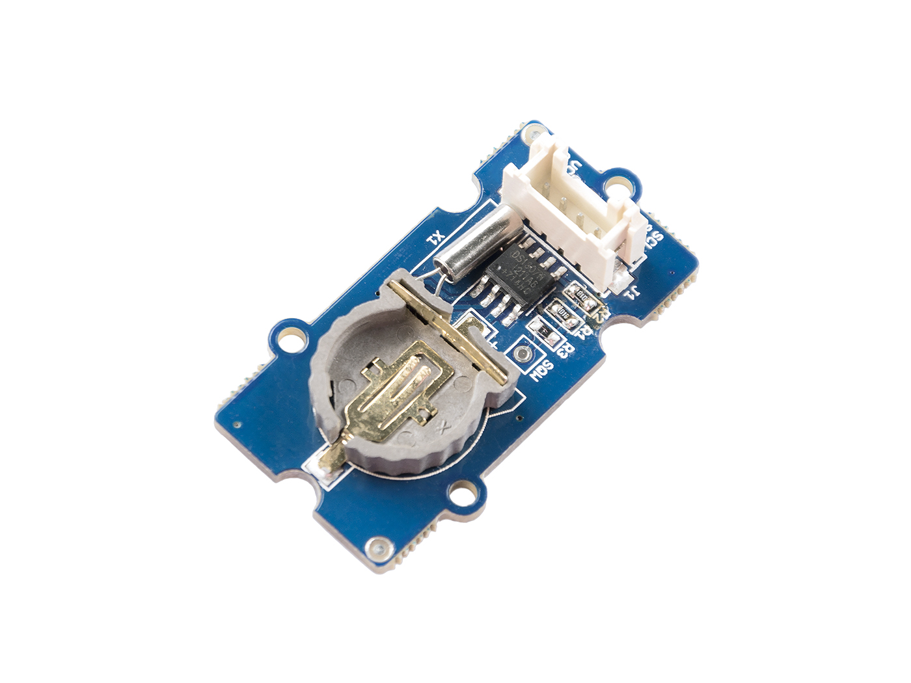

The
http://wiki.seeedstudio.com/Grove-RTC[Grove real-time clock (RTC)]
provides seconds, minutes, hours, day, date, month, and year. The end of the month date is automatically adjusted for months with fewer than 31 days, including corrections for leap years. The clock operates in either the 24-hour or 12-hour format with AM/PM indicator. And it is valid up to 2100. In order to gain a robust performance, you must put a 3-Volt CR1225 lithium cell in the battery-holder. If you use the primary power only, the module may not work normally, because the crystal may not oscillate.

<!--more-->

== Hardware

Plug the sensor into any of the I2C ports on your
https://www.seeedstudio.com/Base-Shield-V2-p-1378.html[Grove shield]:

image::../shield-i2c.png[I2C ports on the Grove shield v2.0, height=250]

== Software

Functions that interact with the real-time clock are prefixed with `rtc`.

=== Initialization

Before the real-time clock can be used, you must connect it to an I2C port on the
Grove shield and call the `rtcInit()` function:

[source, language=C++]
----
/**
Required to initialize real-time clock

*/
void rtcInit();
----

This tells the software library that you are using a real-time and that you
have plugged in into an I2C port.
You must call this function before anything else will work.

=== Setting Time and Date

After initializing the real-time clock, you may need to set the date and time it will start tracking from:

[source, language=C++]
----
/**
Set initial time in rtc - will track from there

@param year

@param month
	@pre: 1 <= month <= 12
@param day
	@pre: 1 <= day <= 31
@param dow - day of week
	@pre: 1 <= dow <= 7
@param hour
	@pre: 0 <= hour <= 23
@param minute
	@pre: 0 <= minute <= 59
@param second
		@pre: 0 <= second <= 59

@modifies	  Time stored in RTC
*/
void rtcSetTimeDate(unsigned int year, unsigned int month, unsigned int day, unsigned int dow, unsigned int hour, unsigned int minute, unsigned int second);
----

=== Get Date

Once set, you can retrieve the date from the real-time clock:

[source, language=C++]
----
/**
Get  date from rtc 

@param year

@param month
	@pre: 1 <= month <= 12
@param day
	@pre: 1 <= day <= 31
@param dow - day of week
	@pre: 1 <= dow <= 7

@modifies	Variables passed in to store respective info
*/
void rtcGetDate(unsigned int& year, unsigned int& month, unsigned int& day, unsigned int& dow);
----

=== Get Time

Once set, you can retrieve the time of day from the real-time clock:

[source, language=C++]
----
/**
Get  time from rtc 

@param hour
	@pre: 0 <= hour <= 23
@param minute
	@pre: 0 <= minute <= 59
@param second
		@pre: 0 <= second <= 59

@modifiesVariables passed in to store respective info
*/
void rtcGetTime(unsigned int& hour, unsigned int& minute, unsigned int& second);
----
