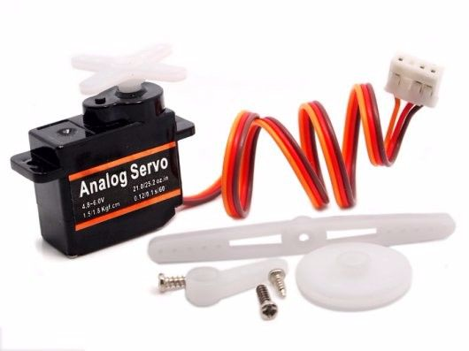

The
https://www.seeedstudio.com/Grove-Servo-p-1241.html[Grove servomotor]
can be used to control rotary position within an 180-degree range.

<!--more-->

== Hardware

Even though your servo may have a label that says "analog servo", it must be
plugged into a **digital port** on your
https://www.seeedstudio.com/Base-Shield-V2-p-1378.html[Grove shield]:

image::../shield-digital.png[Digital ports on the Grove shield v2.0, height=250]

Note that, due to the way the servomotor is wired, the digital pin number
actually may not match the port number!
Inspect the cable closely to be sure of which pin the servomotor's wiring is
connected to.
For example, a servomotor plugged into port D7 may actually be connected to pin
D8 -- **always inspect the physical connection to be sure**.

== Software

Functions that interact with the servomotor are prefixed with `servo`.

=== Initialization

To prepare the software library to use the servomotor, first call the
`servoInit` function, telling it which pin it is connected to:

[source, language=C++]
----
/**
 * Prepare to use a servo module.
 *
 * @param   pin     the **digital** pin the servo is attached to
 */
void servoInit(int pin);
----

=== Servo control

To control the servomotor, pass an angle (between 0 and 180 degrees) to the
`servoMove` function:

[source, language=C++]
----
/**
 * @param   angle   the angle to turn the servo to [degrees]
 *
 * @pre angle >= 0 and angle <= 180
 */
void servoMove(int angle);
----
