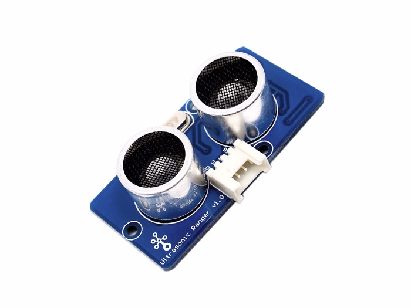

The
http://wiki.seeedstudio.com/Grove-Ultrasonic_Ranger[Grove Ultrasonic Ranger]
is a non-contact distance measurement module. It has a measuring range of 2 - 350cm, with a resolution of 1cm.

<!--more-->

== Hardware

The ultrasonic ranger should be plugged into a **digital port** on your
https://www.seeedstudio.com/Base-Shield-V2-p-1378.html[Grove shield]:

image::../shield-digital.png[Digital ports on the Grove shield v2.0, height=250]

== Software

Functions that interact with the ultrasonic ranger are prefixed with `ultra`.

=== Initialization

To prepare the software library to use the ultrssonic ranger, first call the
`ultraInit` function, telling it which pin it is connected to:

[source, language=C++]
----

/**
 * Prepare the ultrasonic distance sensor for use.
 *
 * @param    digitalPin   pin the chain is connected to (e.g., 4 for D4)
 */
void ultraInit(int digitalPin);
----

=== Get distance control

To retrieve the measured distance in centimeters, call `ultraGetDist()`:

[source, language=C++]
----
/**
 * Get the distance reading from the ultrasonic sensor
 *
 * @return	distance in cm (range of 0 - 400 cm)
 *
 */
long ultraGetDist();
----
